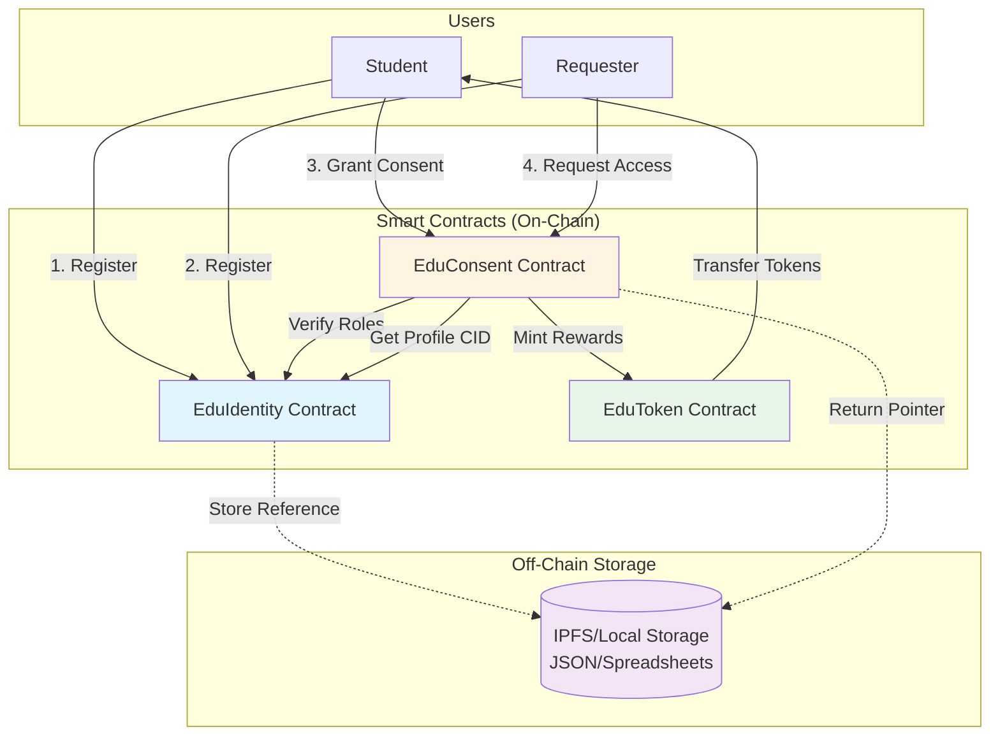
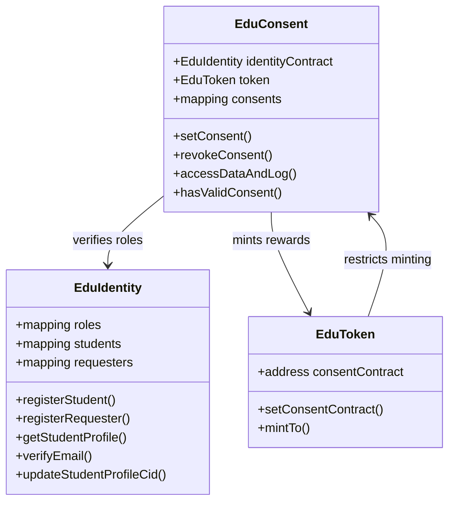
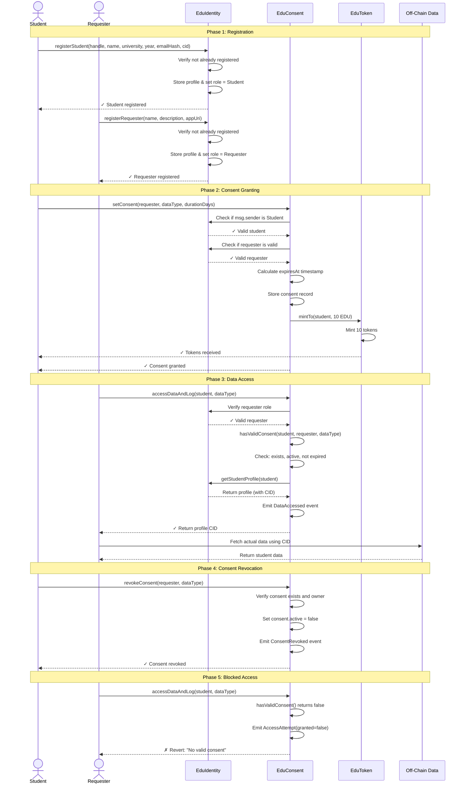
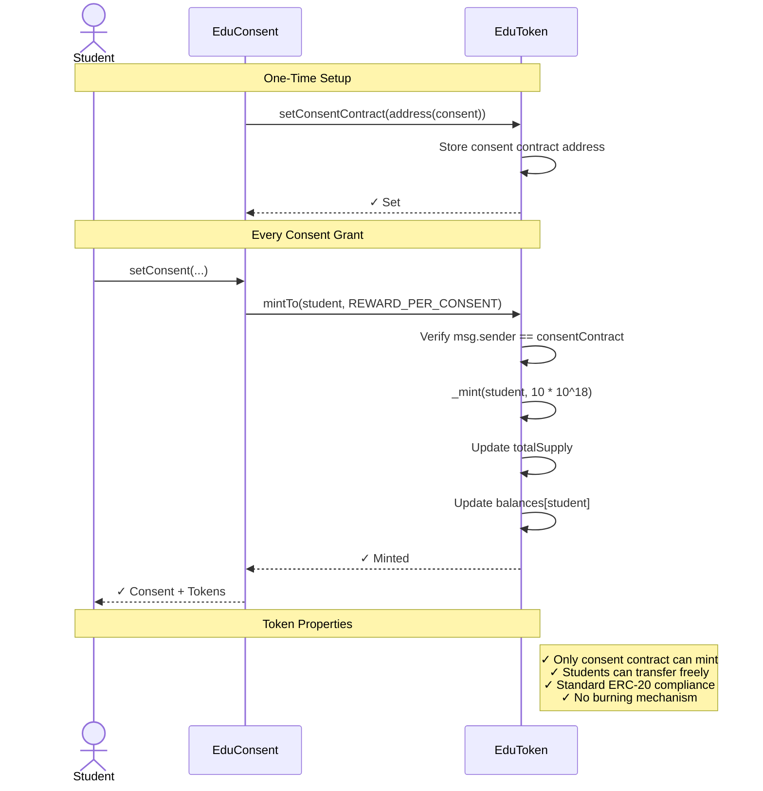
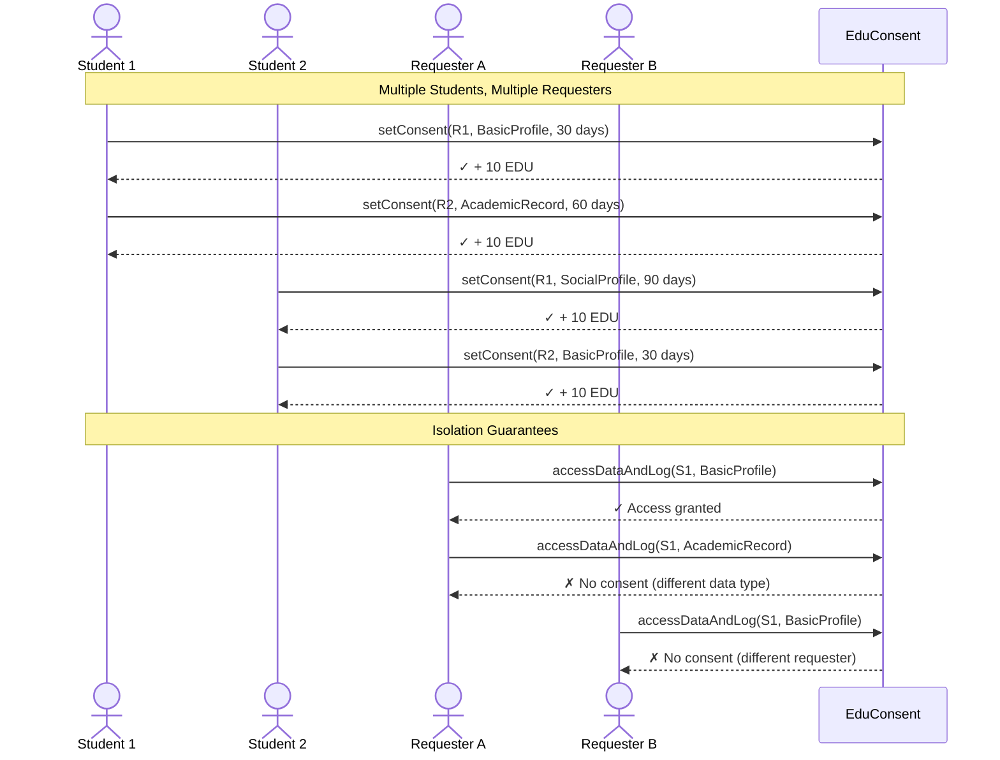
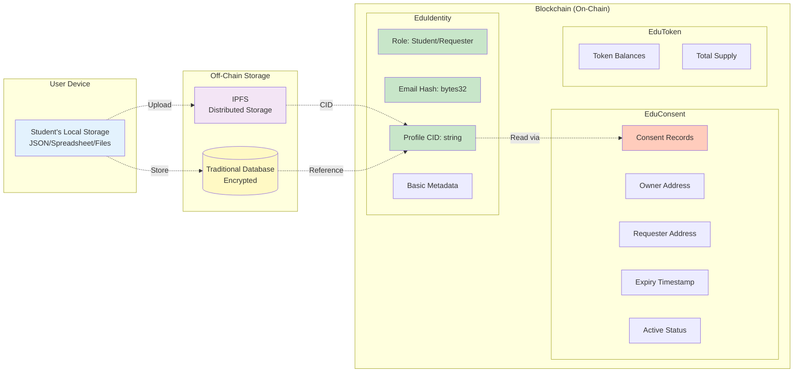
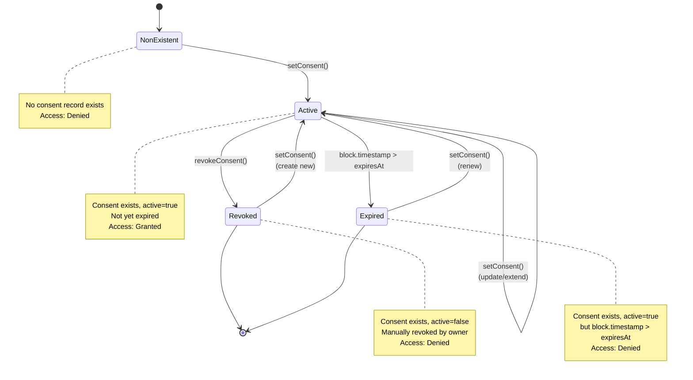
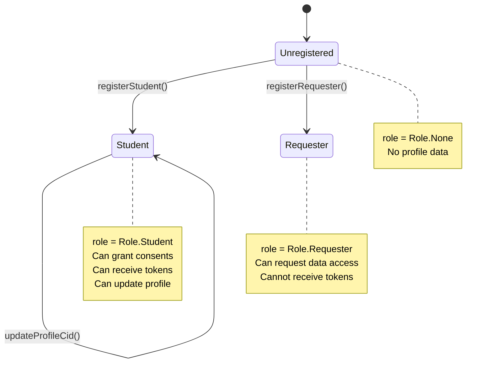
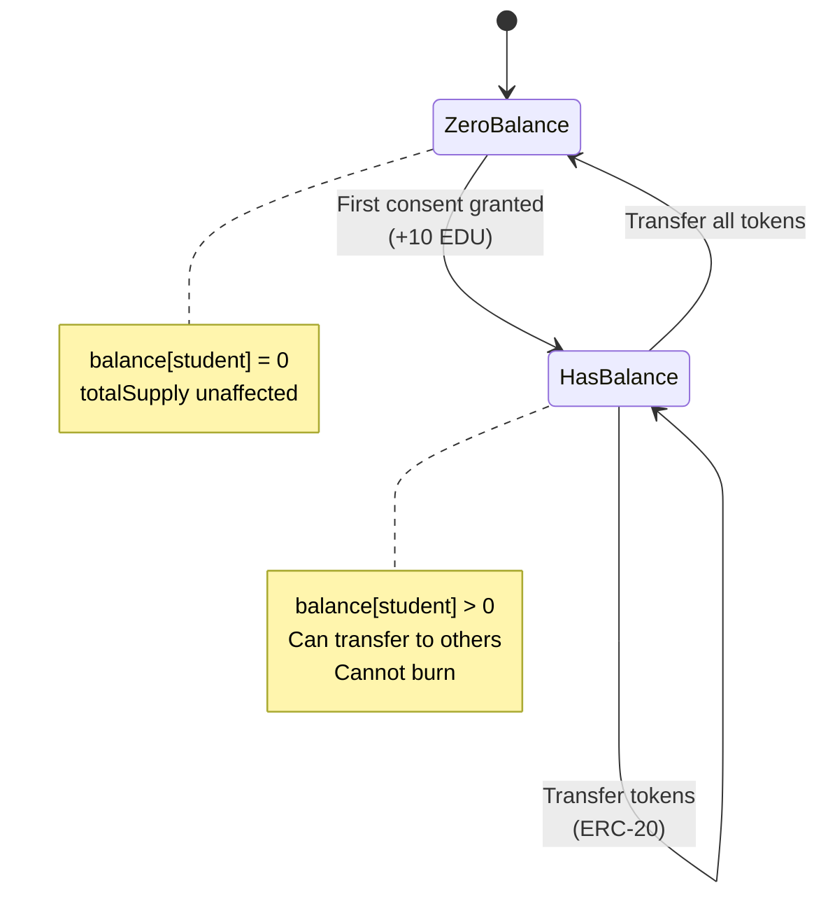

# Architecture Documentation

**Project:** Student Identity Platform  
**Version:** 1.1.0 (Optimized)  
**Date:** November 22, 2025  
**Status:** ✅ Production-Ready with Gas Optimizations

---

## 🎯 Quick Links

- **[📊 Interactive Diagrams (HTML)](./diagrams/render-diagrams.html)** - Open in browser for interactive viewing
- **[📐 Component Diagrams](./diagrams/component-diagram.md)**
- **[🔄 Sequence Diagrams](./diagrams/sequence-diagrams.md)**
- **[📍 State Diagrams](./diagrams/state-diagrams.md)**

## ✅ Optimization Status

All major gas optimizations have been implemented:
- ✅ **Custom Errors** - All contracts updated (saves ~50 gas per revert)
- ✅ **Struct Packing** - Consent struct: 6 slots → 2 slots (saves ~40k gas)
- ✅ **Batch Operations** - `setConsentBatch()` added (18% savings per consent)
- ✅ **Memory Optimization** - Efficient storage patterns throughout

## Table of Contents

1. [System Overview](#system-overview)
2. [Component Diagram](#component-diagram)
3. [Sequence Diagrams](#sequence-diagrams)
4. [Data Flow Architecture](#data-flow-architecture)
5. [State Diagrams](#state-diagrams)
6. [Contract Specifications](#contract-specifications)
7. [Security Architecture](#security-architecture)
8. [Gas Optimizations](#gas-optimizations)

---

## System Overview

The Student Identity Platform is a blockchain-based system that enables students to control their educational data while receiving token rewards for sharing. The platform consists of three main smart contracts deployed on Ethereum-compatible networks.

### Key Features

- **Decentralized Identity Management** - Students and requesters register on-chain
- **Consent-Based Data Sharing** - Permission-based access control
- **Token Incentives** - Students earn EDU tokens for granting consent
- **Privacy-Preserving** - Only metadata stored on-chain, data remains off-chain
- **Granular Permissions** - Per-data-type access control
- **Time-Bound Access** - Automatic consent expiration
- **Complete Audit Trail** - All access attempts logged via events

---

## Component Diagram

### High-Level Architecture



### Contract Relationships



---

## Sequence Diagrams

### 1. Complete User Workflow



### 2. Token Reward Flow



### 3. Multi-User Consent Scenario



---

## Data Flow Architecture

### On-Chain vs Off-Chain Data



### What's Stored Where

| Data Type | Storage Location | Stored On-Chain | Notes |
|-----------|------------------|-----------------|-------|
| **Actual Student Data** | Off-chain (IPFS/Local) | ❌ No | JSON, PDFs, transcripts |
| **Data Hash/CID** | EduIdentity contract | ✅ Yes | IPFS CID or database reference |
| **Email** | Off-chain | ❌ No | Only hash stored |
| **Email Hash** | EduIdentity contract | ✅ Yes | keccak256(email) |
| **Consent Records** | EduConsent contract | ✅ Yes | Who can access what, until when |
| **Access Logs** | Event logs | ✅ Yes | Complete audit trail |
| **Token Balances** | EduToken contract | ✅ Yes | Reward balances |

---

## State Diagrams

### Consent Lifecycle



### User Registration States



### Token Balance Flow



---

## Contract Specifications

### EduIdentity Contract

**Purpose:** Manages user registration and identity verification

**State Variables:**
```solidity
mapping(address => Role) public roles;                    // User role tracking
mapping(address => StudentProfile) public students;       // Student data
mapping(address => RequesterProfile) public requesters;   // Requester data
```

**Key Functions:**

| Function | Access | Purpose | Gas Estimate |
|----------|--------|---------|--------------|
| `registerStudent()` | Public | Register new student | ~150k gas |
| `registerRequester()` | Public | Register new requester | ~120k gas |
| `getStudentProfile()` | View | Retrieve student data | Free (view) |
| `updateStudentProfileCid()` | Student only | Update off-chain data pointer | ~45k gas |
| `verifyEmail()` | View | Verify email without revealing | Free (view) |
| `computeEmailHash()` | Pure | Helper to hash emails | Free (pure) |

**Events:**
- `StudentRegistered(address indexed student, string handle, bytes32 emailHash)`
- `StudentProfileUpdated(address indexed student, string newProfileCid)`
- `RequesterRegistered(address indexed requester, string name)`
- `EmailVerified(address indexed student, bytes32 emailHash)`

---

### EduConsent Contract

**Purpose:** Manages consent permissions and data access logging

**State Variables:**
```solidity
EduIdentity public identityContract;     // Reference to identity contract
EduToken public token;                   // Reference to token contract
mapping(bytes32 => Consent) public consents;  // Consent records (key = hash(owner, requester, dataType))
uint256 public constant REWARD_PER_CONSENT = 10;  // 10 EDU tokens (without decimals)

// Optimized Consent Struct (2 storage slots - saves ~40k gas):
struct Consent {
    address owner;         // 20 bytes - Slot 0
    uint64 expiresAt;      // 8 bytes  - Slot 0
    DataType dataType;     // 1 byte   - Slot 0
    bool exists;           // 1 byte   - Slot 0
    bool active;           // 1 byte   - Slot 0
    // 1 byte padding       - Slot 0
    address requester;     // 20 bytes - Slot 1
}
```

**Key Functions:**

| Function | Access | Purpose | Gas Estimate |
|----------|--------|---------|--------------|
| `setConsent()` | Student only | Grant/update consent | ~78k gas ⭐ Optimized |
| `setConsentBatch()` ⭐ NEW | Student only | Grant multiple consents | ~64k gas/consent (18% savings) |
| `revokeConsent()` | Owner only | Revoke consent | ~30k gas |
| `accessDataAndLog()` | Requester only | Access data with logging | ~20k gas ⭐ Optimized |
| `hasValidConsent()` | View | Check consent validity | Free (view) |
| `getConsent()` | View | Get consent details | Free (view) |

**Events:**
- `ConsentGranted(address indexed owner, address indexed requester, DataType dataType, uint64 expiresAt)`
- `ConsentRevoked(address indexed owner, address indexed requester, DataType dataType)`
- `AccessAttempt(address indexed owner, address indexed requester, DataType indexed dataType, uint64 timestamp, bool granted)`
- `DataAccessed(address indexed owner, address indexed requester, DataType indexed dataType, uint64 timestamp, string dataHash)`

---

### EduToken Contract

**Purpose:** ERC-20 reward token for data sharing

**Inherits:** OpenZeppelin ERC20

**State Variables:**
```solidity
address public consentContract;  // Only address allowed to mint
```

**Key Functions:**

| Function | Access | Purpose | Gas Estimate |
|----------|--------|---------|--------------|
| `setConsentContract()` | One-time | Set minting contract | ~45k gas |
| `mintTo()` | Consent contract only | Mint rewards | ~50k gas |
| Standard ERC-20 | Public | Transfer, approve, etc. | Standard |

**Token Details:**
- Name: "EduShare Token"
- Symbol: "EDU"
- Decimals: 18
- Initial Supply: 0 (minted only via consent)

---

## Security Architecture

### Access Control Matrix

| Action | Student | Requester | Anyone | Contract Only |
|--------|---------|-----------|--------|---------------|
| Register as Student | ✅ | ❌ | ✅ | ❌ |
| Register as Requester | ❌ | ✅ | ✅ | ❌ |
| Grant Consent | ✅ | ❌ | ❌ | ❌ |
| Revoke Consent | ✅ (own) | ❌ | ❌ | ❌ |
| Access Data | ❌ | ✅ (with consent) | ❌ | ❌ |
| Mint Tokens | ❌ | ❌ | ❌ | ✅ (EduConsent) |
| View Profiles | ✅ | ✅ | ✅ | ✅ |
| Update Profile | ✅ (own) | ❌ | ❌ | ❌ |

### Security Features

#### 1. **Privacy Protection**
- ✅ Email stored as hash (keccak256)
- ✅ Actual data stored off-chain
- ✅ Only CID/reference stored on-chain
- ✅ Privacy-preserving email verification

#### 2. **Access Control**
- ✅ Role-based permissions (Student, Requester, None)
- ✅ Consent required for data access
- ✅ Owner-only revocation
- ✅ Time-bound permissions (automatic expiry)

#### 3. **Token Security**
- ✅ Minting restricted to consent contract only
- ✅ One-time consent contract setup
- ✅ No admin privileges
- ✅ Standard ERC-20 safety

#### 4. **Audit Trail**
- ✅ All access attempts logged (successful and failed)
- ✅ Immutable event logs
- ✅ Timestamp tracking
- ✅ Data hash recording

#### 5. **Input Validation**
- ✅ Non-empty strings required
- ✅ Valid enrollment year (> 0)
- ✅ Duration limits (1-365 days)
- ✅ Address checks (non-zero)

### Threat Model & Mitigations

| Threat | Mitigation |
|--------|------------|
| **Unauthorized data access** | Role-based access + consent validation |
| **Identity spoofing** | Blockchain address-based authentication |
| **Email exposure** | Hash storage only |
| **Token inflation** | Minting restricted to consent contract |
| **Consent manipulation** | Owner-only revocation, immutable events |
| **DOS attacks** | Gas optimization, no unbounded loops |
| **Reentrancy** | No external calls in state-changing functions |
| **Front-running** | Consent-based, not price-based |

---

## Design Decisions & Trade-offs

### 1. Off-Chain Data Storage

**Decision:** Store actual data off-chain, only CID on-chain

**Pros:**
- ✅ Lower gas costs
- ✅ No blockchain size bloat
- ✅ Can store large files
- ✅ GDPR compliance (data can be deleted off-chain)

**Cons:**
- ❌ Relies on off-chain availability
- ❌ CID could point to unavailable data

**Mitigation:** Use IPFS for decentralized storage, or redundant databases

---

### 2. Token Rewards for Consent (Not Access)

**Decision:** Mint tokens when consent is granted, not when data is accessed

**Pros:**
- ✅ Incentivizes consent creation
- ✅ Simpler logic (no tracking access count)
- ✅ Students control earning potential

**Cons:**
- ❌ Students might create unnecessary consents
- ❌ No reward for actual data usage

**Rationale:** Consent creation is the valuable action; access is just execution

---

### 3. Time-Bound Consent (Not Permanent)

**Decision:** All consents have expiration dates (1-365 days)

**Pros:**
- ✅ Enhanced security (automatic revocation)
- ✅ Encourages consent review
- ✅ Reduces stale permissions

**Cons:**
- ❌ Requires renewal for long-term access
- ❌ Could expire unexpectedly

**Mitigation:** Allow duration extension via setConsent()

---

### 4. No Admin/Owner Functions

**Decision:** No privileged admin role in contracts

**Pros:**
- ✅ Fully decentralized
- ✅ No single point of control
- ✅ Trustless operation

**Cons:**
- ❌ Cannot fix bugs without redeployment
- ❌ Cannot pause in emergency

**Rationale:** Educational platform prioritizes decentralization

---

## Deployment Architecture

### Local Development
```
Developer Machine
├── Hardhat Node (localhost:8545)
├── Foundry (forge test)
└── TypeScript Scripts (ignition)
```

### Testnet (Optional)
```
Sepolia / Amoy Testnet
├── EduIdentity: 0x...
├── EduToken: 0x...
└── EduConsent: 0x...
```

### Production Considerations
- Use proxy pattern for upgradeability
- Add pausable functionality
- Implement admin multi-sig
- Add emergency withdrawal
- Comprehensive monitoring

---

## Gas Optimization Strategies

### Current Optimizations
1. ✅ Optimizer enabled (200 runs)
2. ✅ Efficient mapping keys (bytes32)
3. ✅ Minimal storage writes
4. ✅ View functions for reads
5. ✅ Packed data types where possible

### Future Optimizations
1. ⚠️ Custom errors instead of string reverts (saves ~50 gas/error)
2. ⚠️ Struct packing (Consent struct could be optimized)
3. ⚠️ Cache storage reads in memory
4. ⚠️ Use calldata instead of memory where possible

---

## Testing Strategy

### Unit Tests (37 tests)
- EduIdentity: Registration, updates, validation
- EduToken: Minting, access control, transfers
- EduConsent: Consent management, access control

### Integration Tests (10 tests)
- Complete workflows
- Multi-user scenarios
- Token accumulation
- Expiration handling

### Scalability Tests (8 tests)
- 10, 50, 100, 500, 1000 users
- Concurrent operations
- Multiple data types
- Gas measurements

---

**End of Architecture Documentation**

*This architecture supports a privacy-preserving, consent-based data sharing platform that incentivizes students while maintaining security and decentralization.*

